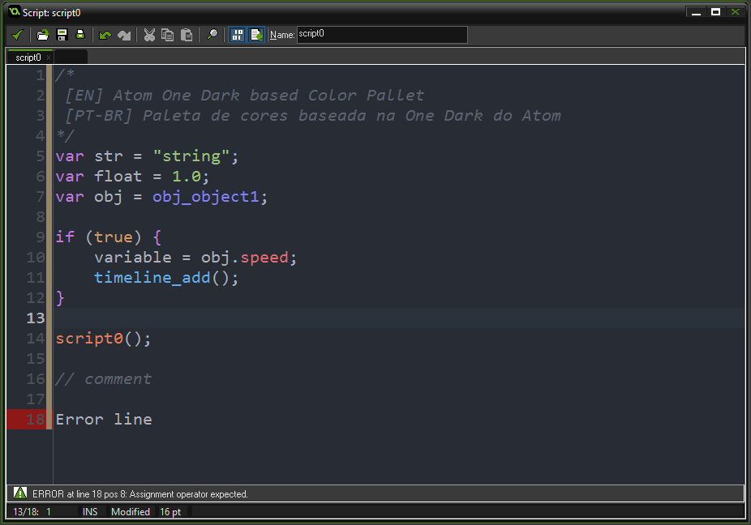

# GameMakerStudio-AtomOneDark-Editor

A GameMaker: Studio editor color pallet based on Atom's One Dark

    

## [EN] Use Instructions

- Download/Clone the Repo (*or just create your own `.col` file copying `pallet.col` code content*)
- In GameMaker: Studio go to:
    - File > Preferences;
    - *Scripts and Code* tab;
    - In **Colors** click on `Import`;
    - Then select the `pallet.col` file.

## [PT-BR] Instruções de Uso

- Faça o Download/Clone do Repositório (*ou crie seu próprio arquivo `.col` copiando o conteúdo de `pallet.col`*)
- No GameMaker: Studio vá em:
    - File > Preferences
    - Na aba *Scripts and Code*
    - Em **Colors** clique em `Import`
    - Então selecione o arquivo `pallet.col`
